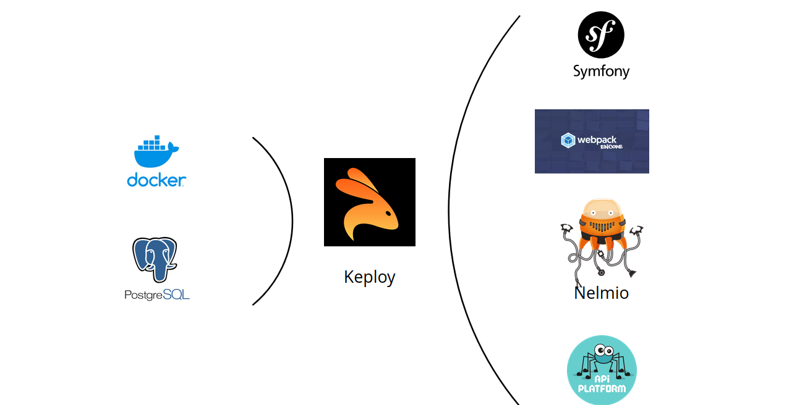

# KEPLOY with PHP and Symfony

> [NOTE]
> This is an experimental repository (aka proof of concept), use it with no limit !

### Project requirements

- [Docker Engine](https://docs.docker.com/installation/)
- Make
- [keploy](https://keploy.io/docs/server/installation/) : local installation needed

## Stack



## `BOOKS and LIBRARY` topics

The project tree simplify to have a whole picture :

```shell
── doc
  └── resources
├── example-book.json // -- extract of API to test with `keploy enterprise` version
├── README.md // -- this file
└── symfony // -- main project folder
    ├── book // -- the application itself project folder
    ├── compose.yaml // -- the docker services description
    ├── docker  // -- the docker services to build
    ├── keploy // -- generated mocks and tests
    ├── keploy.yml // -- keploy configuration
    └── Makefile // -- commands to interact with the project
```

We have to use Symfony "as a binary", with the PHP integrated server.

Go to `symfony` directory and do :

1. `make ENV=test start`
2. `make init-db && make fixtures`
3. Open browser in ghost mode
4. go to "/"
5. go to "http://localhost:8000/login" : test@test.com / test
6. stop record
7. `make ENV=test keploy-record` to record
8. `make ENV=test keploy-test` to test recorded mocks & tests

## Admin area

As we use API platform admin:

1. `make assets`
2. `make init-db && make fixtures`
3. go to "http://localhost:8000/admin"
4. See schema at `http://localhost:8000/api/docs.jsonopenapi`
5. API HTML interaction is `http://localhost:8000/api/docs`

## Make command (to play into "symfony" repository)

```shell
Workflow command:
  start-bdd Start the database with docker up in demonized mode
  start Start the project with docker and build container
  stop Stop the project started with docker
  restart Stop and start the project
  assets Compile assets (take care of message from the command)
  install Create environment docker file, install PHP and node deps
  vendor/autoload_runtime.php Install vendor (use -B to force command)
  composer/% Used to update compose dependencies

CLI command:
  pnpm/% Run a pnpm command like `make pnpm/'run dev'`
  sc/% Run a command console through symfony CLI like `make sc/'c:c'`
  cc Clean all symfony cache, including the file cache and other cache (persisted etc)
  fixtures Load fixtures
  keploy-record Record keploy
  keploy-rerecord Rerecord keploy with TEST as `make ENV=test TEST=books-v1 keploy-rerecord`
  keploy-test Play keploy tests or one test as `make TEST=001-test keploy-test`
  keploy-gen Load keploy record
```

## TODO

Make the tcp://docker:2715 port accessible and not the /var/docker/docker.sock hardcoded > recompile Keploy (make a diff and apply on CI to test)
